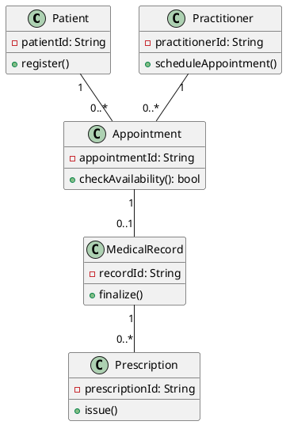

# SmartCare v0.3- Domain Model Workbook
## 1. Requirement-to-Concept Trace
| Requirement                                                          | Concept | State/behavior                                                                      | Decision |
|----------------------------------------------------------------------|---|-------------------------------------------------------------------------------------|---|
| R1.System should allow patients to register and manage their profile | Patient | state: New,Active,Inactive. Behavior:register(),update profile()                    | Maintain as central domain object-single,focused purpose |
| R2.System should maintain practitioner details and specializations   | Practitioner | state:Available,on leave,busy. behavior:set availability()                          | Keep as core domain class |
| R3.Patients can book,reschedule, and cancel appointments             | Appointment | state:Requested,confirmed,completed,canceled. behavior:book(),cancel(),reschedule() | Keep as central association class |
| R4.System should prevent double booking for clients                  | Appointment/Practitioner | check availability() before conforming                                              | Controlled via centralized booking logic in appointment class |
| R5.System should store consultation notes and medical history        | MedicalRecord | state:Draft,finalized. behavior:add note(),finalize()                               | Added as optional class separates clinical data from patient identity |
| R6.Practitioners can issue prescriptions during appointment          | Prescription | States: Issued, Dispensed, Expired. Behavior: issue(), dispense()                   |	Added as optional - extends Appointment |
| R7.System shall send notifications for appointments                  |	Appointment | 	Behavior: sendReminder()                                                            |	Modeled as operation, not separate class |
| R8.Patient can view past appointments and records                    |	Patient, Appointment, MedicalRecord | 	Behavior: viewHistory()                                                             | Relationship navigation: Patient -> Appointment -> MedicalRecord |
| R9.Admin can manage clinic locations and practitioner assignment     |	Clinic | 	Behavior: assignPractitioner()                                                      |	Deferred - considered infrastructure |
| R10.System must maintain data privacy and consent                    | Patient | state: consentFlag, Behavior: giveConsent()                                         | Attribute on Patient, not separate class | 
## 2. CRC Cards
Patient                   
| Responsibilities | Collaborators |
| Knows personal details: patientId, name, DOB, contact, address, consentFlag | Appointment |                                             
| Can request, view, cancel appointments | Practitioner |                                           

Practitioner
| Responsibilities |	Collaborators |
| Knows practitionerId, name, specialization, licenseNo, contact |	Appointment |
| Conducts appointments, creates medical records	| Patient |

Appointment
| Responsibilities |	Collaborators |
| Knows appointmentId, dateTime, duration, status, reasonForVisit, clinicLocation |	Patient |
| Sends reminders | Prescription |

Optional class: MedicalRecord
| Responsibilities |	Collaborators |
| Can be finalized only by Practitioner	| Practitioner |
| Can have multiple Prescriptions |	Prescription |
## 3.UML Class Diagram

Patient - patientId, name, DOB - register(), getHistory()                     
Practitioner - practitionerId, specialty - setAvailability                 
Appointment - appointmentId, dateTime, status - checkAvailability(), confirm(), cancel()                                    
MedicalRecord - recordId, diagnosis - finalize()              
Prescription - prescriptionId, medication - issue()                               

## Relationships:
Patient 1 -- 0..* Appointment (books)           
Practitioner 1 -- 0..* Appointment (manages)            
Appointment 1 -- 0..1 MedicalRecord (generates)             
MedicalRecord 1 -- 0..* Prescription (contains)        

## Design Rationale

**Class Selection:** 
Patient and Practitioner are selected as core actors as per R1 and R2. 
Appointment is the central event class that connects them as per R3. 
MedicalRecord and Prescription are added to satisfy R5 and R6 for storing consultation notes and issuing prescriptions. 
Clinic is added as an optional container class for R9 to manage locations.

**Responsibility Allocation:** 
Patient is responsible for personal details (patientId, name, DOB, contact, address, consentFlag) and can request, view, and cancel appointments. 
Practitioner is responsible for professional details (practitionerId, specialization, licenseNo) and conducts appointments to create medical records. 
Appointment handles dateTime, duration, reasonForVisit and prevents double booking via checkAvailability() for R4. 
MedicalRecord handles notes, diagnosis and moves from Draft to Finalized state.

**Key Relationships:** 
Patient 1 -- 0..* Appointment means one patient can have many appointments. 
Practitioner 1 -- 0..* Appointment means one practitioner handles many appointments. 
Appointment 1 -- 0..1 MedicalRecord means each appointment generates at most one record. 
MedicalRecord 1 -- 0..* Prescription means one record can have many prescriptions. 
These multiplicities enforce R4 and R10 privacy via consentFlag.

## AI Design Review Record
| AI suggestion | Evidence | Decision | Reason | Model change |
|---|---|---|---|---|
| Add Clinic class to manage locations and practitioner assignment | R9 - Admin can manage clinic locations and assignment, Week 6 spec | Accepted | Needed to group practitioners and support R9. Clinic is a valid container | Added Clinic class with relationship Clinic 1 -- 0..* Practitioner, with assignPractitioner() behavior |
| Merge MedicalRecord and Prescription into single Document class | AI suggested simplification to reduce classes | Rejected | R5 and R6 have different lifecycles. Prescription has Issued, Dispensed states, MedicalRecord has Draft, Finalized. Merging violates Single Responsibility | Kept separate classes: MedicalRecord 1 -- 0..* Prescription |
| Add state machine for Appointment with Requested, Confirmed states | R3 and R7 - booking, rescheduling and sending reminders | Accepted | Appointment needs clear lifecycle to handle booking and notifications | Added states: Requested, Confirmed, Completed, Cancelled, plus Behavior: sendReminder() and checkAvailability() |
| Add consentFlag attribute and giveConsent() behavior to Patient | R10 - System must maintain data privacy and consent | Accepted | Privacy is critical. Cannot create MedicalRecord without consent check | Added attribute: consentFlag: bool to Patient and Behavior: giveConsent() with state Pending, Given, Revoked |
| Add checkAvailability() to Practitioner class | R4 - Prevent double booking for clients | Modified | Better placed in Appointment to check both Patient and Practitioner calendars, not just practitioner | Moved behavior to Appointment.checkAvailability() with Collaborators: Patient, Practitioner |