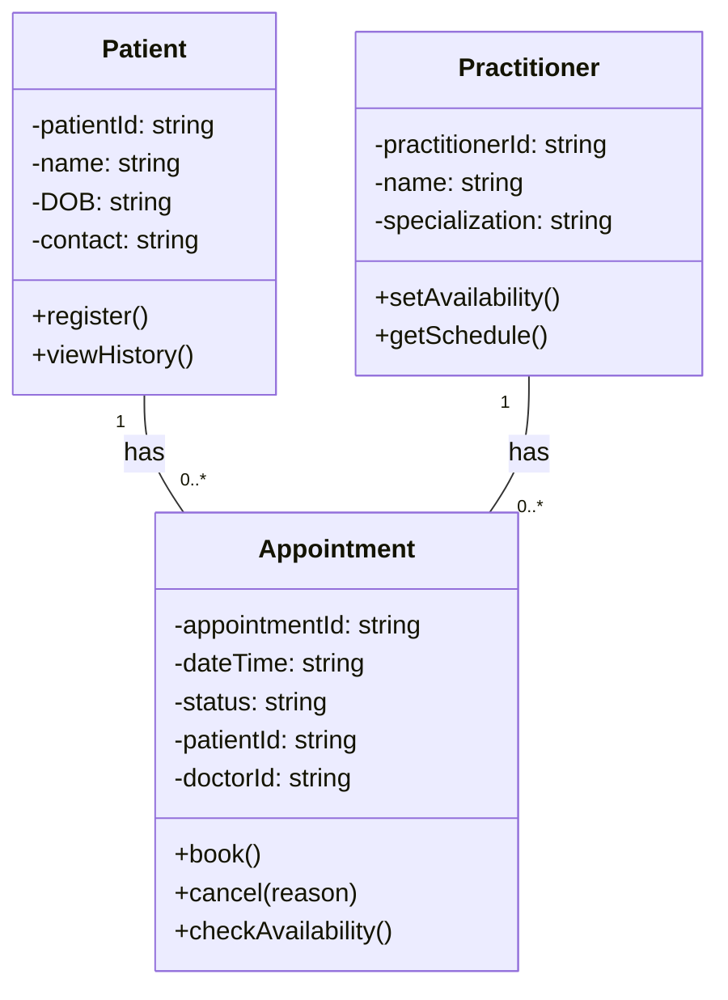

# SmartCare v0.3- Domain Model Workbook
## 1. Requirement-to-Concept Trace
| Requirement                                                  | Concept             | State/behavior                                                        | Decision |
|--------------------------------------------------------------|---------------------|-----------------------------------------------------------------------|---|
| R1.Register Patient- need to add/find patient| Patient             |state:patient_id,name,phone,dob/register(),updateProfile()|Maintain as central domain object-single focused purpose|
| R2.Add Practitioner| Practitioner        |state:Available,On leave/ behavior:setAvailability(),getSchedule()|Keep as core domain class|
|R3.Book Appointment| Appointment         |State:Requested,Confirmed,Completed,canceled/behavior:book(),reschedule()|Keep as central association class linking Patient & Practitioner|
|R4. No double booking| Appointment         |Behavior:checkAvailability(),before confirm|Check done in one central place before booking|
|R5.Search Patient| Patient             |behavior:searchByID(),SearchByPhone()|Solves difficulty finding info|
|R6.Cancel appointment| Appointment         |state:Canceled/behavior:cancel(reason)|Canceled must stay in history|
|R7.View history| Patient appointment |behavior:viewHistory(),getbyDate()|Link between Patient and Appointment|
|R8.View appointments by date/doctor|Practitioner+Appointment|Behavior:getBydate(),getByDoctor()|

## 2. CRC Cards
Patient 

| Responsibilities                             | Collaborators |
|----------------------------------------------|---|
| Knows patientId, name, DOB, contact, address | Appointment |                                             
| Can view appointment history                 |  Appointment|                                           

Practitioner

| Responsibilities |	Collaborators |
|---|---|
| Knows practitionerId, name, specialization |	Appointment |
| Knows availability,can set schedule|Appointment|

Appointment

| Responsibilities                              | 	Collaborators |
|-----------------------------------------------|--------------|
| Knows appointmentID,dateTime,status,patientID | Patient      |       
| Can book(),cancel(),checkAvailability()| Practitioner| 

Optional class: ClinicRegistry

| Responsibilities                     | 	Collaborators        |
|--------------------------------------|----------------------|
| Manages all lists,save file,search   | Patient/Practitioner | 	              
| Checks double booking before booking | 	Appointment          |

## 3.UML Class Diagram

## Relationships:
Relationship 1: Patient (1) to Appointment (0..*)
- One Patient can have zero to many Appointments
- One Appointment belongs to exactly one Patient
- Defensible: New patient has 0, old patient has many. Appointment needs patientId to exist.
- Solves R7 View History

Relationship 2: Practitioner (1) to Appointment (0..*)
- One Practitioner can have zero to many Appointments  
- One Appointment has exactly one Practitioner
- Defensible: Prevents double booking R5, allows view by doctor/date R8.

No direct relationship between Patient and Practitioner
- They connect only through Appointment
- Keeps domain small and maintainable .

## Design Rationale

## 1. Class Selection:
I selected 3 classes - Patient, Practitioner, Appointment.
Patient and Practitioner are needed to store people information.
Appointment is needed to store booking information.
I kept only 3 classes to make system small and easy to maintain.

## 2. Responsibility Allocation:
Patient - This class only stores patient details like name and contact.
Practitioner - This class only stores doctor details like name and specialization.
Appointment - This class does all booking work. 
It has methods like book(), cancel() and checkAvailability(). 
All booking logic is in one place.

## 3. Key Relationships:
Patient (1) -- (0..*) Appointment : One patient can have many appointments, but one appointment belongs to only one patient.
Practitioner (1) -- (0..*) Appointment : One doctor can have many appointments, but one appointment belongs to only one doctor.
There is no direct connection between Patient and Practitioner. They connect only through Appointment. This makes the design simple and clean.

## AI Design Review Record
| AI suggestion | Evidence | Decision | Reason | Model change |
|---|---|---|---|---|
|Add relationship patient 1 to 0..* Appointment|One patient can have many bookings|Accepted|It is logical and needed for history|Added link between Patient and Appointment|
|Add relationship Practitioner 1 to 0..* Appointment|One doctor can have many bookings|Accepted|It is correct and makes design simple|Added link between Practitioner and Appointment|
|Add extra class like MedicalRecord|AI said for future use|Rejected|We need to keep model small and maintainable|No change|
|Add PatientID and doctorID in Appointment| To connect the classes| Accepted|Needed to link the objects|Added two attributes in Appointment|

## Reflection
Hardest was deciding Appointment relationship. AI added extra classes like Database.I rejected them because as per stage 2 requirements I only used 3 classes.